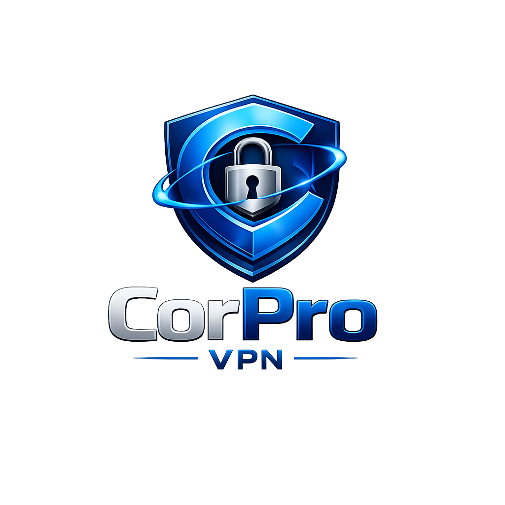

<div align="center">
  
  <h1>Corpo VPN</h1>
  <p><strong>Zero-Trust Enterprise Security & WireGuard Automation</strong></p>
</div>

---

## 🛡️ Overview

**Corpo VPN** is a graduation project built to modernize remote workforce security. It combines the blazing-fast cryptography of the **WireGuard** protocol with a **Zero-Trust Architecture** that actively scans host machines for compliance before granting network access. 

If a user's machine is compromised (e.g., Antivirus is disabled, Firewall is off, or suspicious processes are running), the tunnel refuses to connect, protecting the internal network from lateral movement.

## ✨ Key Features

- **Blazing Fast Cryptography**: Built on WireGuard for maximum throughput and minimal battery drain.
- **Pre-Flight Compliance Scanning**: Scans Windows OS (using native PowerShell APIs) for:
  - Active Antivirus Protection (Windows Defender or 3rd Party)
  - Enabled Firewall Status
  - BitLocker Drive Encryption
  - Suspicious Background Processes
- **Automated Peer Provisioning**: Bypasses the need for manual `.conf` files. The backend API securely generates private/public keypairs, assigns IPs, and injects them directly into the VPS kernel.
- **Admin Dashboard**: Role-based access control allowing administrators to bypass compliance checks, monitor live connection stats, and re-provision peers.
- **Secure Authentication**: Passwordless OTP authentication powered by Supabase and the Brevo Email API.

## 🏗️ Technology Stack

Corpo VPN is a fully integrated stack spanning the desktop client, the API backend, and the Linux routing infrastructure.

### Desktop Client (Frontend)
- **Frameworks**: Electron.js, React 18, Vite
- **Styling**: Tailwind CSS, Phosphor Icons
- **System Integration**: Native Node.js `child_process` for Windows PowerShell querying and `wg-quick` tunnel management.

### Centralized API (Backend)
- **Framework**: NestJS (TypeScript)
- **Database & Auth**: Supabase (PostgreSQL), JWT session management
- **Email Delivery**: Brevo HTTP API (replaces SMTP for reliable OTPs)
- **Deployment**: Hosted on Render

### VPN Infrastructure
- **Server OS**: Ubuntu Linux VPS
- **Protocol**: WireGuard (`wg0`)
- **Routing**: `iptables` NAT forwarding
- **Microservice**: A dedicated Node.js/Express API running on the VPS to handle automated `wg set` and `wg-quick save` peer injection.

## 🚀 How It Works

1. **Auth & Identity**: The user logs into the Electron app using their corporate email and an OTP.
2. **Configuration Fetch**: The desktop client retrieves the user's pre-assigned WireGuard configuration (Private Key, Assigned IP) from the NestJS backend.
3. **Endpoint Validation**: The Electron Main Process executes an invisible PowerShell script to validate system health. 
4. **Tunnel Initialization**: If compliant, the client uses `electron-builder` bundled binaries to write a temporary `wg0.conf` and executes a WireGuard handshake directly with the VPS on port `51820`.
5. **Live Monitoring**: The UI streams live `rx/tx` byte counts and handshake timestamps via IPC channels.

## 🛠️ Development & Build

### Prerequisites
- Node.js (v18+)
- Windows 10/11 (Required for the desktop client compliance features)

### Building the Desktop Client

```bash
cd "grad project draft front"
npm install
npm run electron:build
```
This will compile the React UI, bundle the Electron backend, and output a portable `Corpo VPN Setup 1.0.0.exe` installer inside the `dist-electron` folder.

## 📄 License

Created as a Full-Stack Graduation Project (2026).
