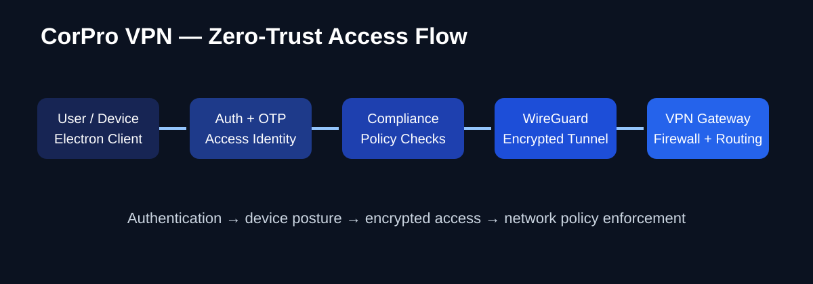

# CorPro VPN

## Zero-Trust VPN Security & WireGuard Automation

**CorPro VPN** is a Cybersecurity Engineering graduation project demonstrating a controlled remote-access workflow combining WireGuard, endpoint posture checks, authentication, centralized peer provisioning, network policy enforcement, and security monitoring.

> **Project status:** Educational / portfolio project. Components should be independently validated and hardened before production deployment.

### Why this project

Traditional VPN access can establish an encrypted tunnel without proving that the connecting endpoint meets an organization's security policy. CorPro VPN explores a stronger workflow:

**Identity → device posture → access decision → encrypted tunnel → network policy**

### What I built

- WireGuard-based encrypted VPN connectivity
- Endpoint compliance checks for security posture signals
- Authentication / OTP-based access workflow
- Automated WireGuard peer provisioning
- Administrative policy and connection visibility
- Firewall and routing integration
- IP / GeoIP policy enforcement
- Security logging and operational monitoring

### Security architecture

User / Device
→ Authentication + OTP
→ Endpoint Compliance
→ Access Decision
→ WireGuard Tunnel
→ VPN Gateway
→ Firewall / Routing / Protected Network

**Important:** compliance is treated as a security signal, not proof that a device is uncompromised.

### Technology

- Client: Electron, React, Vite, Tailwind CSS
- API: Node.js / TypeScript
- Data: Supabase / PostgreSQL
- VPN: WireGuard on Ubuntu Linux
- Network security: iptables, routing, access policies

### Documentation

- Threat Model: docs/THREAT_MODEL.md
- Security Policy: SECURITY.md

### Demonstration

Live project: https://corpo-vpn.vercel.app/

### My role

**Hassan Faris — Cybersecurity Engineer**

Focused on the VPN security architecture, WireGuard integration, endpoint compliance workflow, network policy enforcement, and security-oriented project documentation.

### Links

- GitHub: https://github.com/faris7assan
- LinkedIn: https://www.linkedin.com/in/hassan-faris
- Portfolio: https://hassanhamedfaris69.base44.app

### Security notice

Use only on systems and networks you own or are explicitly authorized to administer. Never commit private keys, credentials, tokens, or production configuration.
