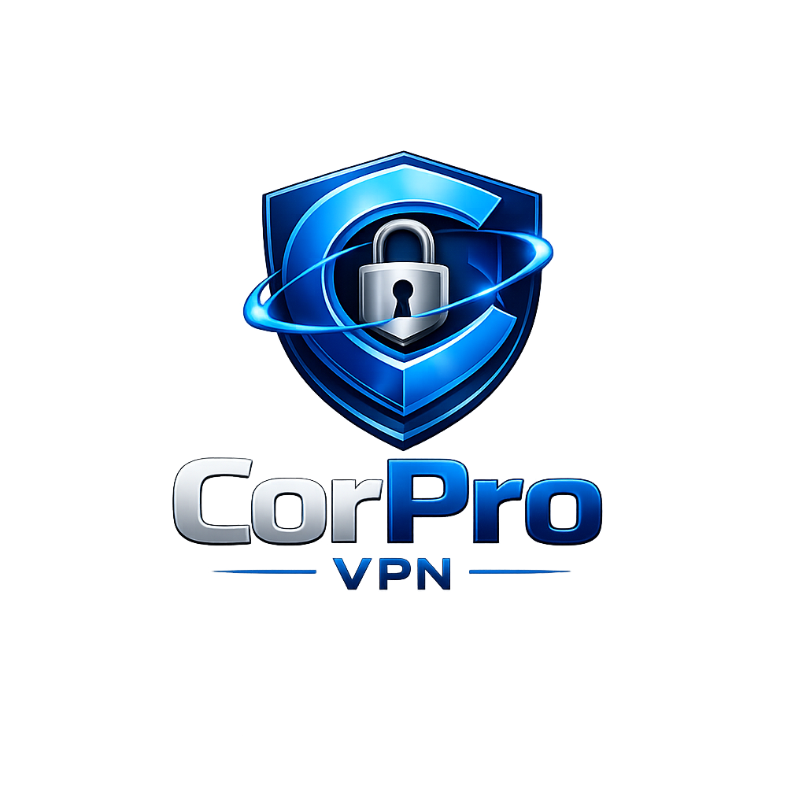

> **Repository note:** This is an earlier mirror of the CORPO VPN graduation project. The maintained portfolio repository is [`faris7assan/corpo-vpn`](https://github.com/faris7assan/corpo-vpn), which contains the latest documentation and security-focused updates.

<div align="center">
  
  <h1>Corpo VPN</h1>
  <p><strong>Zero-Trust Enterprise Security & WireGuard Automation</strong></p>
  <a href="https://corpo-vpn.vercel.app/"><strong>🌐 Live Demo & App Download</strong></a>
</div>

---

## 🛡️ Overview

**Corpo VPN** is a graduation project built to modernize remote workforce security. It combines the **WireGuard** protocol with a **Zero-Trust Architecture** that actively scans host machines for compliance before granting network access.

If a user's machine is compromised (e.g., Antivirus is disabled, Firewall is off, or suspicious processes are running), the tunnel refuses to connect, protecting the internal network from lateral movement.

## ✨ Key Features

- **WireGuard-based encrypted connectivity**
- **Pre-Flight Compliance Scanning** using native PowerShell APIs for antivirus, firewall, BitLocker, and suspicious processes
- **Automated Peer Provisioning** through the backend API
- **Admin Dashboard** with role-based administration and connection monitoring
- **Secure Authentication** using OTP-based access control

## 🏗️ Technology Stack

### Desktop Client
- Electron.js, React 18, Vite
- Tailwind CSS, Phosphor Icons
- Native Node.js `child_process` for Windows PowerShell querying and tunnel management

### Backend
- NestJS / TypeScript
- Supabase / PostgreSQL
- JWT session management
- Brevo HTTP API for OTP delivery

### VPN Infrastructure
- Ubuntu Linux VPS
- WireGuard (`wg0`)
- `iptables` NAT forwarding
- Node.js/Express peer-provisioning service

## 🚀 How It Works

1. User authenticates with corporate email and OTP.
2. The client retrieves the assigned VPN configuration.
3. Endpoint compliance checks evaluate the local security posture.
4. If the policy requirements are satisfied, the client establishes the WireGuard tunnel.
5. Connection state and traffic statistics are monitored.

## 🛠️ Development & Build

### Prerequisites
- Node.js v18+
- Windows 10/11 for desktop compliance features

### Building the Desktop Client

```bash
cd "grad project draft front"
npm install
npm run electron:build
```

## 📚 Maintained Documentation

For the latest portfolio-oriented documentation, architecture, and security policy, use the maintained repository:

**https://github.com/faris7assan/corpo-vpn**

## 📄 License

Created as a Full-Stack Graduation Project (2026).
